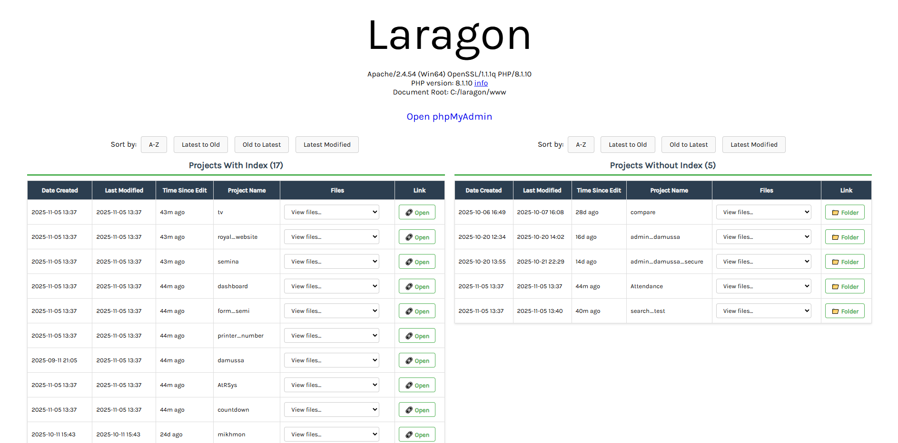
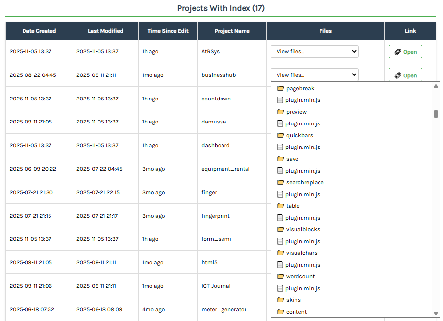
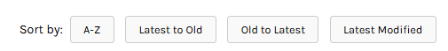

# Laragon Project Dashboard

A modern, feature-rich dashboard for managing and viewing your Laragon projects with an intuitive interface and powerful sorting capabilities.


## 🌟 Features

### Dual Table Layout
- **Projects with Index**: Displays projects containing `index.php` or `index.html`
- **Projects without Index**: Shows projects without index files
- Side-by-side layout for easy comparison

### Rich Project Information
- **Date Created**: When the project folder was created
- **Last Modified**: Last modification timestamp
- **Time Since Edit**: Human-readable time since last edit (e.g., "2h ago", "3d ago")
- **Project Name**: Clear project identification
- **Folder Tree Dropdown**: Navigate through project files and folders
- **Quick Links**: One-click access to open projects

### Advanced Sorting
Each table supports independent sorting:
- **A-Z**: Alphabetical sorting by project name
- **Latest to Old**: Newest projects first (by creation date)
- **Old to Latest**: Oldest projects first (by creation date)
- **Latest Modified**: Most recently modified projects first

### Interactive Folder Navigation
- Dropdown menu showing complete folder structure (2 levels deep)
- Visual indicators: 📁 for folders, 📄 for files
- Click any file/folder to open in a new tab
- Automatically filters hidden files and folders

### Auto-Refresh
- Automatically refreshes project list every 30 seconds
- Maintains current sort order during refresh

### Smart Filtering
- Hides files/folders starting with `.` (hidden files like `.git`, `.tmp`, etc.)
- Clean, clutter-free project list

## 📋 Requirements

- **Laragon** (or any local PHP development environment)
- **PHP 7.0+**
- Web server (Apache/Nginx)

## 🚀 Installation

1. **Clone the repository**
   ```bash
   git clone https://github.com/salumuomary/laragon-project-explorer.git
   ```

2. **Copy files to your document root**
   - Copy `index.php` and `projects.php` to your Laragon's document root
   - Default location: `C:\laragon\www\`

3. **Access the dashboard**
   - Open your browser and navigate to `http://localhost`

## 📁 File Structure

```
laragon-project-dashboard/
├── index.php           # Main dashboard page
├── projects.php        # Backend logic and table generation
├── README.md          # This file
├── LICENSE            # MIT License
└── screenshots/       # Screenshots for documentation
```

## 🎨 Screenshots

### Dashboard Overview
The main dashboard displays two tables side by side with all your projects organized by index file presence.


### Folder Tree Dropdown
Each project has an interactive dropdown menu showing its complete file structure for quick navigation.


### Sorting Options
Independent sorting controls for each table with visual feedback on the active sort method.


## ⚙️ Configuration

### Customizing Auto-Refresh Interval
Edit `index.php` and modify the interval (default is 30000ms = 30 seconds):

```javascript
setInterval(() => loadProjects('both'), 30000); // Change 30000 to your preferred interval
```

### Adjusting Folder Tree Depth
Edit `projects.php` and modify the depth check in the `getDirectoryTree()` function:

```php
if (substr_count($prefix, '  ') < 2) { // Change 2 to your preferred depth
```

### Changing phpMyAdmin Port
Edit `index.php` and update the phpMyAdmin link:

```html
<a href="http://localhost:808/phpmyadmin" target="_blank">Open phpMyAdmin</a>
```

## 🔧 How It Works

1. **Scanning Projects**: The script scans the document root directory for folders
2. **Categorization**: Projects are divided into two categories based on index file presence
3. **Sorting**: Each table can be independently sorted using different criteria
4. **File Tree**: Recursively builds a file tree for each project (limited depth)
5. **Auto-Update**: AJAX calls refresh the tables every 30 seconds without page reload

## 🤝 Contributing

Contributions are welcome! Here's how you can help:

1. Fork the repository
2. Create a feature branch (`git checkout -b feature/AmazingFeature`)
3. Commit your changes (`git commit -m 'Add some AmazingFeature'`)
4. Push to the branch (`git push origin feature/AmazingFeature`)
5. Open a Pull Request

## 📝 To-Do

- [ ] Add search/filter functionality
- [ ] Project templates support
- [ ] Database connection testing
- [ ] Project statistics and analytics
- [ ] Custom project tags/categories
- [ ] Export project list to CSV/JSON
- [ ] Dark mode support
- [ ] Project favoriting/pinning

## 🐛 Known Issues

- Very large folders may take time to load in the dropdown
- File tree depth is limited to prevent performance issues

## 📄 License

This project is licensed under the MIT License - see the [LICENSE](LICENSE) file for details.

## 👨‍💻 Author

Created with ❤️ for the Laragon community

## 🙏 Acknowledgments

- [Laragon](https://laragon.org/) - Amazing local development environment
- The PHP community for continuous support and inspiration

## 📞 Support

If you encounter any issues or have questions:
- Open an issue on GitHub
- Check existing issues for solutions
- Contribute to the documentation

## ⭐ Star History

If you find this project useful, please consider giving it a star!

---

**Happy Coding! 🚀**
